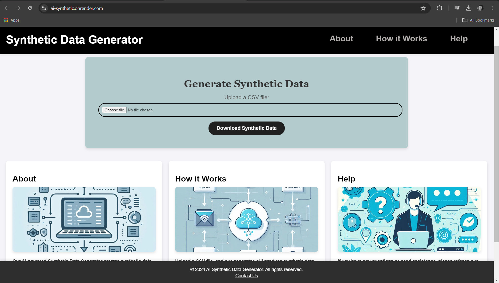

# 🚀 Synthetic Data Generator

Welcome to the **AI-Powered Synthetic Data Generator**! 🔥 This web application helps you create **realistic synthetic datasets** with just a few clicks. Upload a CSV file, and let AI handle the rest! 🤖📊

---

## ✨ Features
✅ Upload your dataset (CSV format)
✅ Generate high-quality synthetic data
✅ Download the processed dataset instantly
✅ Simple & user-friendly interface 🎯

---

## 📸 Screenshots
Take a look at our awesome interface! 👇



---

## 🚀 How to Run
Follow these steps to get started:

1️⃣ Clone the repository:
```bash
git clone https://github.com/Dev05Chikara/ai-Synthetic
```
2️⃣ Navigate to the project directory:
```bash
cd ai-Synthetic
```
3️⃣ Install dependencies:
```bash
pip install -r requirements.txt
```
4️⃣ Run the application:
```bash
python app.py
```
5️⃣ Open **`http://127.0.0.1:5000/`** in your browser & start generating synthetic data! 🌟

---

## 🌍 Live Deployment
Experience the tool live here 👉 [AI Synthetic Data Generator](https://ai-synthetic.onrender.com/)

---

## 📜 License
This project is licensed under the **MIT License**. Feel free to contribute and improve! 💡

