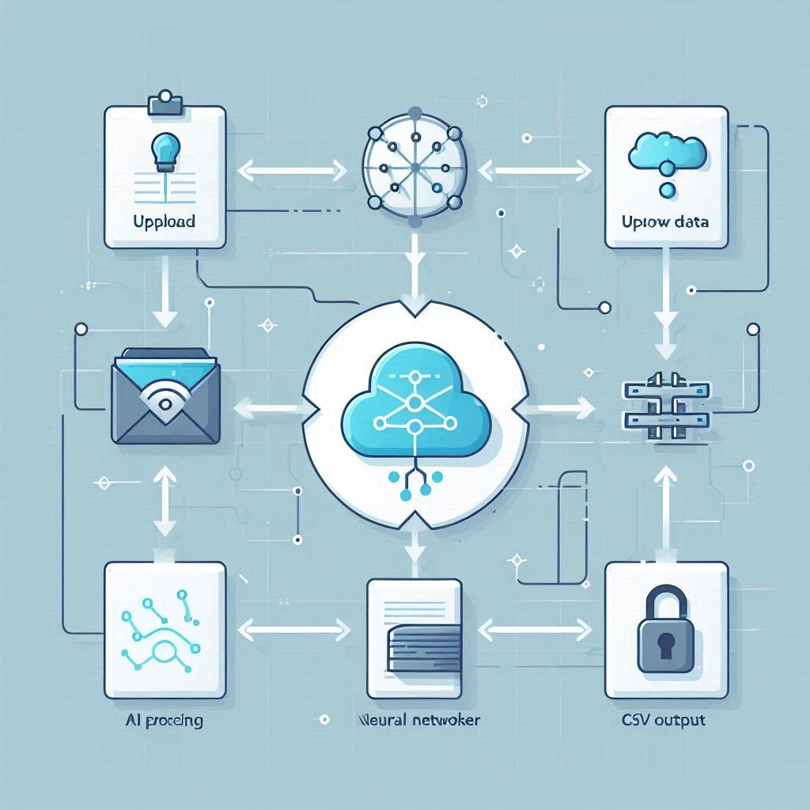

# 🚀 AI-Generated Synthetic Data

Welcome to the **AI-Powered Synthetic Data Generator**! 🎉 This project leverages AI to generate high-quality synthetic datasets while ensuring data privacy and security. Whether you're a researcher, data scientist, or developer, this tool helps you work with synthetic data without exposing sensitive information. 🔐

---

## 📌 Features
✅ **Upload CSV Files** – Easily upload your dataset in CSV format.  
✅ **AI-Generated Synthetic Data** – Create realistic synthetic data while preserving statistical integrity.  
✅ **Privacy-Preserving** – Ensures data privacy without compromising on insights.  
✅ **User-Friendly Interface** – A clean, modern UI for seamless user experience.  
✅ **Downloadable Output** – Get your synthetic data in CSV format instantly.  

---

## 🎯 How It Works
1️⃣ **Upload a CSV File** – Simply drag and drop your dataset. 📂  
2️⃣ **AI Processes the Data** – Our advanced model generates synthetic data while maintaining original patterns. 🧠  
3️⃣ **Download the Output** – Get your newly created dataset with just one click! 📥  

---

## 📸 Project Screenshots
### Home Page 🏠

### How It Works ⚙️

### Help Section ❓


---

## 📦 Installation & Setup
1️⃣ **Clone this repository:**  
```bash
 git clone https://github.com/yourusername/ai-generated-synthetic-data.git
```
2️⃣ **Navigate into the directory:**  
```bash
 cd ai-generated-synthetic-data
```
3️⃣ **Install dependencies:**  
```bash
 pip install -r requirements.txt
```
4️⃣ **Run the application:**  
```bash
 python app.py
```

Your app will be running on `http://localhost:5000/` 🎯

---

## 📚 Technologies Used
🖥️ **Frontend:** HTML, CSS, JavaScript  
⚡ **Backend:** Flask (Python)  
📊 **Machine Learning:** GANs for synthetic data generation  
📂 **Data Format:** CSV  

---

## 👨‍💻 Contributing
Contributions are welcome! Feel free to fork this repository, create a feature branch, and submit a pull request. 🙌

---

## 📞 Contact Us
📧 **Email:** devchikara0705@gmail.com  
📍 **Location:** GLA University, Mathura, India  

---

### ⭐ If you like this project, don't forget to give it a star! ⭐

